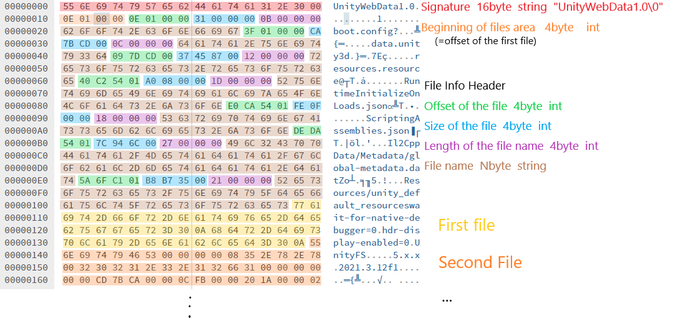

[](README.md)
[](README.kr)

---

# UWDTool
유니티 WebGL 게임에서 사용하는 에셋 등을 포함하는 데이터 파일을 추출, 패킹하거나 포함하는 파일의 정보를 확인할 수 있는 도구.

## 설치 및 사용법
### 설치
```
pip install uwdtool
```

### CLI
```
uwdtool <동작옵션> [-i 입력경로] [-o 출력경로]
```

* -p --pack: 입력 경로의 파일들을 UnityWebData 파일로 만들어 출력 경로에 저장한다.
이 때 입력 경로는 패킹할 파일들을 포함하고 있는 폴더의 경로이다.
* -u --unpack: 입력 경로의 UnityWebData 파일을 언패킹하여 출력 경로에 저장한다.
이 때 입력 경로는 언패킹할 파일의 경로이며, 출력경로는 파일들이 저장될 폴더의 경로이다.
* -isp --inspect: 입력경로의 UnityWebData 파일이 포함하고 있는 파일들의 정보를 출력한다.
여기에는 파일의 이름과 크기가 표시됩니다. 출력 경로는 필요하지 않다.
* -h --help: 도움말 및 프로그램의 정보를 출력한다.

### Python
```python
from uwdtool import UWDTool

UWDTool.Packer(input_path, output_path).pack()  # packing
UWDTool.UnPacker(input_path, output_path).unpack()  # unpacking
UWDTool.Inspector(input_path, output_path).inspect()  # inspector
```


## UnityWebData 파일이란
UnityWebData 파일은 WebGL 게임에서 wasm 파일과 함께 로드되어 사용되는 파일로, 주로 에셋, 리소스 및 메타데이터 파일을 모두 묶은 하나의 파일이다.

유니티 5.0 ~ 2019까지는 `.unityweb`이라는 확장자를 사용하였으며, 이후 버전에서는 `.data`라는 확장자를 사용하는 것으로 바뀌었다.
빌드시 gzip 및 brotli 압축을 지원하는데, 2019 이후에는 빌드된 데이터 파일의 확장자를 `.data.gz` 혹은 `.data.br`처럼 지정하여서
확장자만 보고 압축 유형을 알 수 있지만, 이전에는 압축 여부 및 종류와 관계없이 `.unityweb` 확장자를 사용하였다.
따라서 파일 로드시 압축할 때 표시한 마커를 이용해서 압축 여부 및 종류를 판단하여 로드했다.

다만 압축이 되있다 하더라도 압축을 해제한 이후에 얻을 수 있는 실제 UnityWebData 파일의 구조는 모두 동일하다.

## UnityWebData 구조


### 헤더
|    명칭    | 크기(byte) |  자료형   |                 설명                 |
|:--------:| :------------: |:------:|:----------------------------------:|
|   시그니처   | 16 | string |        "UnityWebData1.0\0"         |
| 파일 시작 위치 | 4 | uint32 | 나열된 파일들의 시작 위치이며 첫번째 파일의 시작 위치와 같다 |

### 파일 정보 헤더
파일 시작 위치 전까지 아래 묶음이 각 파일별로 반복된다.

| 명칭 | 크기(byte) |  자료형   |     설명      |
| :------------: | :------------: |:------:|:-----------:|
| 파일 위치 | 4 | uint32 |  파일의 시작 위치  |
| 파일 크기 | 4 | uint32 |   파일의 크기    |
| 파일 이름 길이 | 4 | uint32 | 파일 이름의 길이 n |
| 파일 이름 | n | string |    파일 이름    |

### 파일 영역
이후에는 파일들이 나열되어있다.
어떤 파일을 읽고자 한다면 헤더에서 해당 파일의 위치와 크기를 가져와서 해당 위치부터 크기만큼의 바이트를 읽으면 된다.
